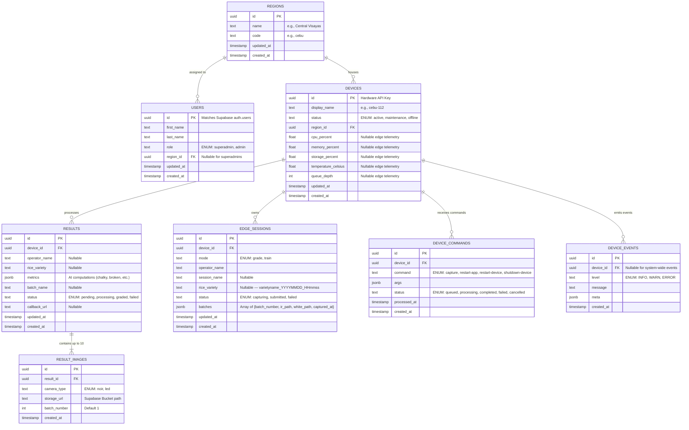

# Database Schema

## ER Diagram



---

## `results.metrics` JSONB Shape

The `metrics` column stores the output of the AI inference pipeline after it has been transformed into the canonical analytics schema. Do **not** store the raw `ai-vision-model` report payload directly — use the transformation function in `app/utils/metrics.py`.

See [metrics-contract.md](./metrics-contract.md) for the full field spec, grade mapping table, and transformation code.

**Quick reference — expected keys:**

| Key | Type | Example |
|-----|------|---------|
| `qualityGrade` | `"A"\|"B"\|"C"\|"D"` | `"B"` |
| `rawGrade` | string | `"Grade No. 2"` |
| `totalGrains` | int | `112` |
| `grainSizeClass` | string | `"long"` |
| `limitingFactor` | string | `"chalky_kernels_pct"` |
| `brokenGrains` | float | `8.93` |
| `chalkinessPercentage` | float | `6.25` |
| `discolorationPercentage` | float | `0.71` |
| `foreignMatter` | float | `0.0` |
| `moistureContent` | float\|null | `null` (sensor not yet integrated) |
| `grainLengthMm` | float\|null | `6.8` |
| `qualityScore` | float\|null | `null` (not yet implemented) |
| `parameters` | object | Full PNS/BAFS parameter set |

---

## Approach: SQL via Supabase Dashboard

No CLI, no Docker, nothing installed locally. All schema setup is done through the **Supabase SQL Editor** online.

**Source of truth**: [`../schema.sql`](../schema.sql) — single consolidated file, current state.  
**Reference data**: [`../seed.sql`](../seed.sql) — regions seed, safe to re-run.

The `migrations/` folder contains the historical incremental files for reference only. Do not apply them to a fresh database — use `schema.sql` instead.

---

## Setup (fresh Supabase project)

1. SQL Editor → paste `schema.sql` → Run
2. SQL Editor → paste `seed.sql` → Run
3. Storage → New bucket → name `result-images` → Private

---

## Schema SQL (embedded copy — canonical file is `../schema.sql`)

```sql
-- ============================================================
-- TRIGGER FUNCTION: auto-update updated_at
-- ============================================================
CREATE OR REPLACE FUNCTION update_updated_at_column()
RETURNS TRIGGER AS $$
BEGIN
    NEW.updated_at = NOW();
    RETURN NEW;
END;
$$ LANGUAGE plpgsql;


-- ============================================================
-- TABLE: regions
-- ============================================================
CREATE TABLE regions (
    id          UUID        PRIMARY KEY DEFAULT gen_random_uuid(),
    name        TEXT        NOT NULL,
    code        TEXT        NOT NULL UNIQUE,
    created_at  TIMESTAMPTZ NOT NULL DEFAULT NOW(),
    updated_at  TIMESTAMPTZ NOT NULL DEFAULT NOW()
);

CREATE TRIGGER trg_regions_updated_at
    BEFORE UPDATE ON regions
    FOR EACH ROW EXECUTE FUNCTION update_updated_at_column();


-- ============================================================
-- TABLE: users  (mirrors auth.users)
-- ============================================================
-- NOTE: id must match the UUID from Supabase auth.users.
-- A trigger or edge function should insert a row here on signup.
CREATE TABLE users (
    id          UUID        PRIMARY KEY REFERENCES auth.users(id) ON DELETE CASCADE,
    first_name  TEXT        NOT NULL,
    last_name   TEXT        NOT NULL,
    role        TEXT        NOT NULL CHECK (role IN ('superadmin', 'admin')),
    region_id   UUID        REFERENCES regions(id) ON DELETE SET NULL, -- nullable for superadmins
    created_at  TIMESTAMPTZ NOT NULL DEFAULT NOW(),
    updated_at  TIMESTAMPTZ NOT NULL DEFAULT NOW()
);

CREATE INDEX idx_users_region_id ON users(region_id);

CREATE TRIGGER trg_users_updated_at
    BEFORE UPDATE ON users
    FOR EACH ROW EXECUTE FUNCTION update_updated_at_column();


-- ============================================================
-- TABLE: devices
-- ============================================================
CREATE TABLE devices (
    id           UUID        PRIMARY KEY DEFAULT gen_random_uuid(),
    display_name TEXT        NOT NULL,
    status       TEXT        NOT NULL DEFAULT 'active'
                             CHECK (status IN ('active', 'maintenance', 'offline')),
    region_id    UUID        NOT NULL REFERENCES regions(id) ON DELETE RESTRICT,
    cpu_percent  DOUBLE PRECISION,
    memory_percent DOUBLE PRECISION,
    storage_percent DOUBLE PRECISION,
    temperature_celsius DOUBLE PRECISION,
    queue_depth  INTEGER,
    created_at   TIMESTAMPTZ NOT NULL DEFAULT NOW(),
    updated_at   TIMESTAMPTZ NOT NULL DEFAULT NOW()
);

CREATE INDEX idx_devices_region_id ON devices(region_id);

CREATE TRIGGER trg_devices_updated_at
    BEFORE UPDATE ON devices
    FOR EACH ROW EXECUTE FUNCTION update_updated_at_column();


-- ============================================================
-- PATCH: telemetry columns for existing deployments
-- ============================================================
ALTER TABLE devices ADD COLUMN IF NOT EXISTS cpu_percent DOUBLE PRECISION;
ALTER TABLE devices ADD COLUMN IF NOT EXISTS memory_percent DOUBLE PRECISION;
ALTER TABLE devices ADD COLUMN IF NOT EXISTS storage_percent DOUBLE PRECISION;
ALTER TABLE devices ADD COLUMN IF NOT EXISTS temperature_celsius DOUBLE PRECISION;
ALTER TABLE devices ADD COLUMN IF NOT EXISTS queue_depth INTEGER;

-- Per-device authentication credentials (required for edge auth)
ALTER TABLE devices ADD COLUMN IF NOT EXISTS device_secret_hash TEXT;
ALTER TABLE devices ADD COLUMN IF NOT EXISTS device_secret_rotated_at TIMESTAMPTZ;


-- ============================================================
-- TABLE: results
-- ============================================================
CREATE TABLE results (
    id            UUID        PRIMARY KEY DEFAULT gen_random_uuid(),
    device_id     UUID        NOT NULL REFERENCES devices(id) ON DELETE RESTRICT,
    operator_name TEXT        NOT NULL,
    rice_variety  TEXT,       -- nullable; filled in by admin after the fact
    metrics       JSONB       NOT NULL DEFAULT '{}',
    created_at    TIMESTAMPTZ NOT NULL DEFAULT NOW(),
    updated_at    TIMESTAMPTZ NOT NULL DEFAULT NOW()
);

CREATE INDEX idx_results_device_id ON results(device_id);

CREATE TRIGGER trg_results_updated_at
    BEFORE UPDATE ON results
    FOR EACH ROW EXECUTE FUNCTION update_updated_at_column();


-- ============================================================
-- TABLE: result_images
-- ============================================================
CREATE TABLE result_images (
    id           UUID        PRIMARY KEY DEFAULT gen_random_uuid(),
    result_id    UUID        NOT NULL REFERENCES results(id) ON DELETE CASCADE,
    camera_type  TEXT        NOT NULL CHECK (camera_type IN ('noir', 'led')),
    storage_url  TEXT        NOT NULL,
    created_at   TIMESTAMPTZ NOT NULL DEFAULT NOW()
);

CREATE INDEX idx_result_images_result_id ON result_images(result_id);


-- ============================================================
-- TABLE: device_commands
-- ============================================================
CREATE TABLE device_commands (
    id           UUID        PRIMARY KEY DEFAULT gen_random_uuid(),
    device_id    UUID        NOT NULL REFERENCES devices(id) ON DELETE CASCADE,
    command      TEXT        NOT NULL CHECK (
                             command IN ('capture', 'restart-app', 'restart-device', 'shutdown-device')
                 ),
    args         JSONB       NOT NULL DEFAULT '{}',
    status       TEXT        NOT NULL DEFAULT 'queued' CHECK (
                             status IN ('queued', 'processing', 'completed', 'failed', 'cancelled')
                 ),
    processed_at TIMESTAMPTZ,
    created_at   TIMESTAMPTZ NOT NULL DEFAULT NOW()
);

CREATE INDEX idx_device_commands_device_id_created_at
    ON device_commands(device_id, created_at DESC);


-- ============================================================
-- TABLE: device_events
-- ============================================================
CREATE TABLE device_events (
    id         UUID        PRIMARY KEY DEFAULT gen_random_uuid(),
    device_id  UUID        REFERENCES devices(id) ON DELETE SET NULL,
    level      TEXT        NOT NULL CHECK (level IN ('INFO', 'WARN', 'ERROR')),
    message    TEXT        NOT NULL,
    meta       JSONB       NOT NULL DEFAULT '{}',
    created_at TIMESTAMPTZ NOT NULL DEFAULT NOW()
);

CREATE INDEX idx_device_events_created_at ON device_events(created_at DESC);
CREATE INDEX idx_device_events_device_id_created_at
    ON device_events(device_id, created_at DESC);


-- ============================================================
-- TABLE: suggestions  (E2E connection test / feedback)
-- ============================================================
CREATE TABLE suggestions (
    id         UUID        PRIMARY KEY DEFAULT gen_random_uuid(),
    title      TEXT        NOT NULL,
    body       TEXT        NOT NULL,
    user_id    UUID        REFERENCES auth.users(id) ON DELETE SET NULL,
    created_at TIMESTAMPTZ NOT NULL DEFAULT NOW()
);
```

---

---

## Supabase Dashboard Setup Guide

No CLI, no Docker. Everything runs in the browser.

---

### 1. Create a Supabase project

1. Go to [supabase.com](https://supabase.com) and sign in (or create a free account)
2. Click **New project**
3. Fill in:
   - **Name** — e.g., `rice-thesis`
   - **Database password** — save this somewhere safe
   - **Region** — pick the closest to the Philippines (Singapore is the nearest)
4. Wait ~1 minute for provisioning

---

### 2. Get your credentials

Go to **Project Settings → API** and copy:

| Variable                    | Where to find it                                            |
| --------------------------- | ----------------------------------------------------------- |
| `VITE_SUPABASE_URL`         | Project URL (e.g., `https://xxxx.supabase.co`)              |
| `VITE_SUPABASE_ANON_KEY`    | `anon` `public` key                                         |
| `SUPABASE_SERVICE_ROLE_KEY` | `service_role` key (for FastAPI backend only — keep secret) |

Add to `web-dashboard/.env`:

```env
VITE_SUPABASE_URL=https://<project-ref>.supabase.co
VITE_SUPABASE_ANON_KEY=<anon-key>
```

Add to `api-server/.env`:

```env
SUPABASE_URL=https://<project-ref>.supabase.co
SUPABASE_SERVICE_ROLE_KEY=<service-role-key>
SUPABASE_JWT_SECRET=<jwt-secret>
```

The JWT secret is under **Project Settings → API → JWT Settings**.

---

### 3. Run SQL — Step 1: Tables & Triggers

Open **SQL Editor → New query**, paste the full Schema SQL from above, click **Run**.

This creates all core tables (`regions`, `users`, `devices`, `results`, `result_images`, `device_commands`, `device_events`, `suggestions`), their indexes, and the `updated_at` auto-update triggers.

---

### 4. Run SQL — Step 2: Auth User Trigger

> **Re-run this if you see "Database error saving new user"** — the DROP statements make it safe to run multiple times.

Open a **new query** in the SQL Editor and run:

```sql
-- Drop first so this is safe to re-run
DROP TRIGGER IF EXISTS on_auth_user_created ON auth.users;
DROP FUNCTION IF EXISTS handle_new_auth_user();

CREATE OR REPLACE FUNCTION handle_new_auth_user()
RETURNS TRIGGER AS $$
BEGIN
    INSERT INTO public.users (id, first_name, last_name, role)
    VALUES (
        NEW.id,
        COALESCE(
            NULLIF(NEW.raw_user_meta_data->>'first_name', ''),
            NULLIF(split_part(COALESCE(NEW.raw_user_meta_data->>'full_name', NEW.raw_user_meta_data->>'name', ''), ' ', 1), ''),
            ''
        ),
        COALESCE(
            NULLIF(NEW.raw_user_meta_data->>'last_name', ''),
            ''
        ),
        COALESCE(NULLIF(NEW.raw_user_meta_data->>'role', ''), 'admin')
    )
    ON CONFLICT (id) DO NOTHING;

    RETURN NEW;
EXCEPTION WHEN OTHERS THEN
    RETURN NEW; -- Never block sign-up. CompleteProfilePage handles missing data.
END;
$$ LANGUAGE plpgsql SECURITY DEFINER;

CREATE TRIGGER on_auth_user_created
    AFTER INSERT ON auth.users
    FOR EACH ROW EXECUTE FUNCTION handle_new_auth_user();
```

This fires automatically whenever a new user signs up via Supabase Auth, inserting a matching row into `public.users`. `SECURITY DEFINER` is required so the function has permission to write to `public.users`.

When calling `supabase.auth.signUp()` from the frontend, pass the metadata so the trigger can populate the profile:

```ts
supabase.auth.signUp({
  email,
  password,
  options: {
    data: { first_name, last_name, role: "admin" },
  },
});
```

---

### 5. Run SQL — Step 3: Enable Row Level Security

Open a **new query** and run:

```sql
ALTER TABLE regions       ENABLE ROW LEVEL SECURITY;
ALTER TABLE users         ENABLE ROW LEVEL SECURITY;
ALTER TABLE devices       ENABLE ROW LEVEL SECURITY;
ALTER TABLE results       ENABLE ROW LEVEL SECURITY;
ALTER TABLE result_images ENABLE ROW LEVEL SECURITY;
ALTER TABLE device_commands ENABLE ROW LEVEL SECURITY;
ALTER TABLE device_events ENABLE ROW LEVEL SECURITY;
ALTER TABLE suggestions   ENABLE ROW LEVEL SECURITY;
```

This locks down direct PostgREST access. Since FastAPI uses the `service_role` key, it bypasses RLS entirely — RLS is a second defensive layer for anything that uses the `anon` or `authenticated` keys directly.

Define per-table policies once your roles are finalized (superadmins see all regions, admins see only their own region).

---

### 6. Run SQL — Step 4: RLS policy for profile completion

Open a **new query** and run:

```sql
-- Allow authenticated users to read, insert, and update their own profile row.
-- INSERT is needed because CompleteProfilePage uses upsert (handles trigger failures).
CREATE POLICY "Users can read own profile"
    ON public.users FOR SELECT
    TO authenticated
    USING (auth.uid() = id);

CREATE POLICY "Users can insert own profile"
    ON public.users FOR INSERT
    TO authenticated
    WITH CHECK (auth.uid() = id);

CREATE POLICY "Users can update own profile"
    ON public.users FOR UPDATE
    TO authenticated
    USING (auth.uid() = id)
    WITH CHECK (auth.uid() = id);
```

---

### 7. Create a Storage bucket for images

1. Go to **Storage → New bucket**
2. Name it `result-images`
3. Set it to **Private** (FastAPI handles all uploads using the service role key — no public access needed)

The `storage_url` column in `result_images` stores the path within this bucket (e.g., `results/<result_id>/noir.jpg`).
