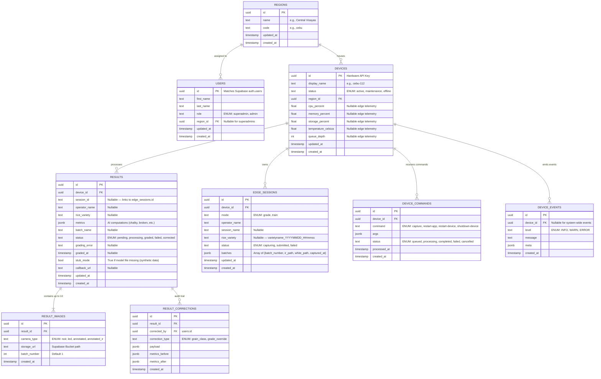

# Database Schema

## ER Diagram



---

## `results.metrics` JSONB Shape

The `metrics` column stores the output of the AI inference pipeline after it has been transformed into the canonical analytics schema. Do **not** store the raw `ai-vision-model` report payload directly — use the transformation function in `app/utils/metrics.py`.

See [metrics-contract.md](./metrics-contract.md) for the full field spec, grade mapping table, and transformation code.

**Quick reference — expected keys:**

| Key | Type | Example |
|-----|------|---------|
| `qualityGrade` | `"A"\|"B"\|"C"\|"D"` | `"B"` |
| `rawGrade` | string | `"Grade No. 2"` |
| `totalGrains` | int | `112` |
| `grainSizeClass` | string | `"long"` |
| `limitingFactor` | string | `"chalky_kernels_pct"` |
| `brokenGrains` | float | `8.93` |
| `chalkinessPercentage` | float | `6.25` |
| `discolorationPercentage` | float | `0.71` |
| `foreignMatter` | float | `0.0` |
| `moistureContent` | float\|null | `null` (sensor not yet integrated) |
| `grainLengthMm` | float\|null | `6.8` |
| `qualityScore` | float\|null | `null` (not yet implemented) |
| `parameters` | object | Full PNS/BAFS parameter set |

---

## Approach: SQL via Supabase Dashboard

No CLI, no Docker, nothing installed locally. All schema setup is done through the **Supabase SQL Editor** online.

**Source of truth**: [`../schema.sql`](../schema.sql) — single consolidated file, current state.  
**Reference data**: [`../seed.sql`](../seed.sql) — regions seed, safe to re-run.

---

## Supabase Dashboard Setup Guide

No CLI, no Docker. Everything runs in the browser.

---

### 1. Create a Supabase project

1. Go to [supabase.com](https://supabase.com) and sign in (or create a free account)
2. Click **New project**
3. Fill in:
   - **Name** — e.g., `rice-thesis`
   - **Database password** — save this somewhere safe
   - **Region** — pick the closest to the Philippines (Singapore is the nearest)
4. Wait ~1 minute for provisioning

---

### 2. Get your credentials

Go to **Project Settings → API** and copy:

| Variable                    | Where to find it                                            |
| --------------------------- | ----------------------------------------------------------- |
| `VITE_SUPABASE_URL`         | Project URL (e.g., `https://xxxx.supabase.co`)              |
| `VITE_SUPABASE_ANON_KEY`    | `anon` `public` key                                         |
| `SUPABASE_SERVICE_ROLE_KEY` | `service_role` key (for FastAPI backend only — keep secret) |

Add to `web-dashboard/.env`:

```env
VITE_SUPABASE_URL=https://<project-ref>.supabase.co
VITE_SUPABASE_ANON_KEY=<anon-key>
```

Add to `api-server/.env`:

```env
SUPABASE_URL=https://<project-ref>.supabase.co
SUPABASE_SERVICE_ROLE_KEY=<service-role-key>
SUPABASE_JWT_SECRET=<jwt-secret>
```

The JWT secret is under **Project Settings → API → JWT Settings**.

---

### 3. Run `schema.sql`

Open **SQL Editor → New query**, paste the full contents of [`../schema.sql`](../schema.sql), click **Run**.

This creates all tables, indexes, triggers (including `updated_at` auto-update and the Supabase auth user sync trigger), enables RLS on all tables, and adds RLS policies for the `users` table — everything in one shot. All statements use `IF NOT EXISTS` / `OR REPLACE` so it's safe to re-run.

> **If you see "Database error saving new user" on sign-up**, re-run `schema.sql` — the `DROP TRIGGER IF EXISTS` / `DROP FUNCTION IF EXISTS` guards make it idempotent.

When calling `supabase.auth.signUp()` from the frontend, pass metadata so the auth trigger can populate the profile:

```ts
supabase.auth.signUp({
  email,
  password,
  options: {
    data: { first_name, last_name, role: "admin" },
  },
});
```

---

### 4. Run `seed.sql`

Open a **new query**, paste [`../seed.sql`](../seed.sql), click **Run**. Inserts the 17 PSA-defined Philippine regions. Safe to re-run.

---

### 5. Create a Storage bucket for images

1. Go to **Storage → New bucket**
2. Name it `result-images`
3. Set it to **Private** (FastAPI handles all uploads using the service role key — no public access needed)

The `storage_url` column in `result_images` stores the path within this bucket (e.g., `results/<result_id>/noir.jpg`).
